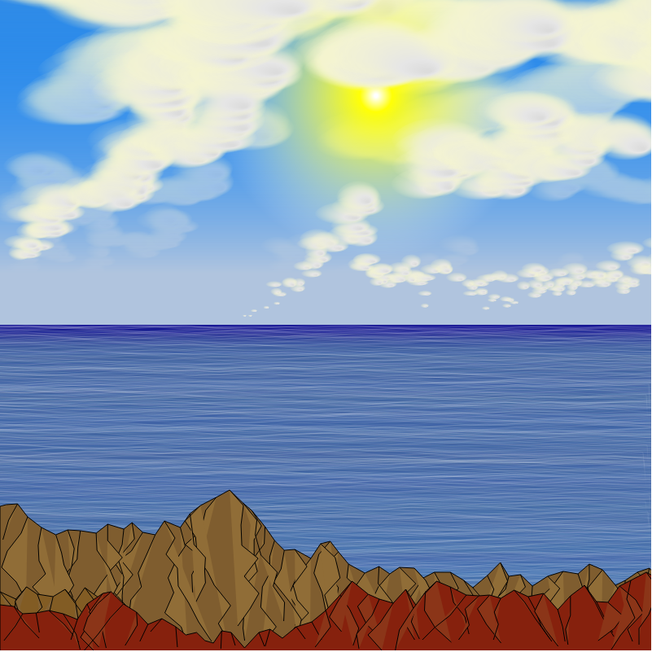
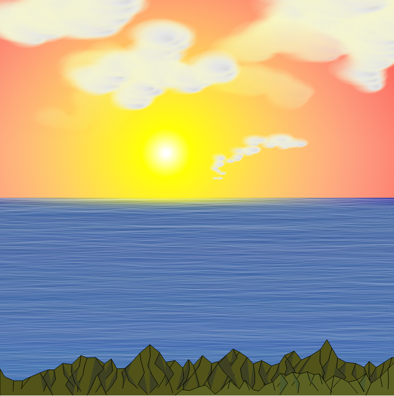
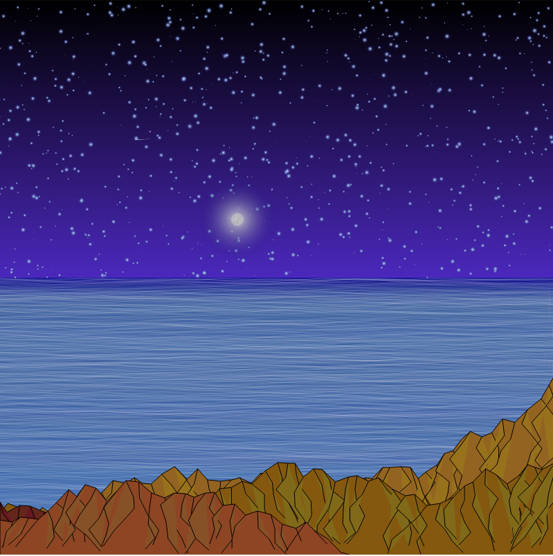
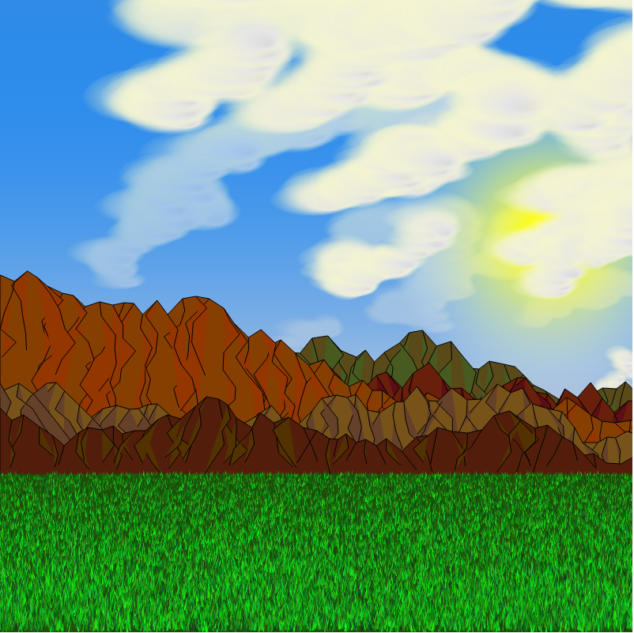
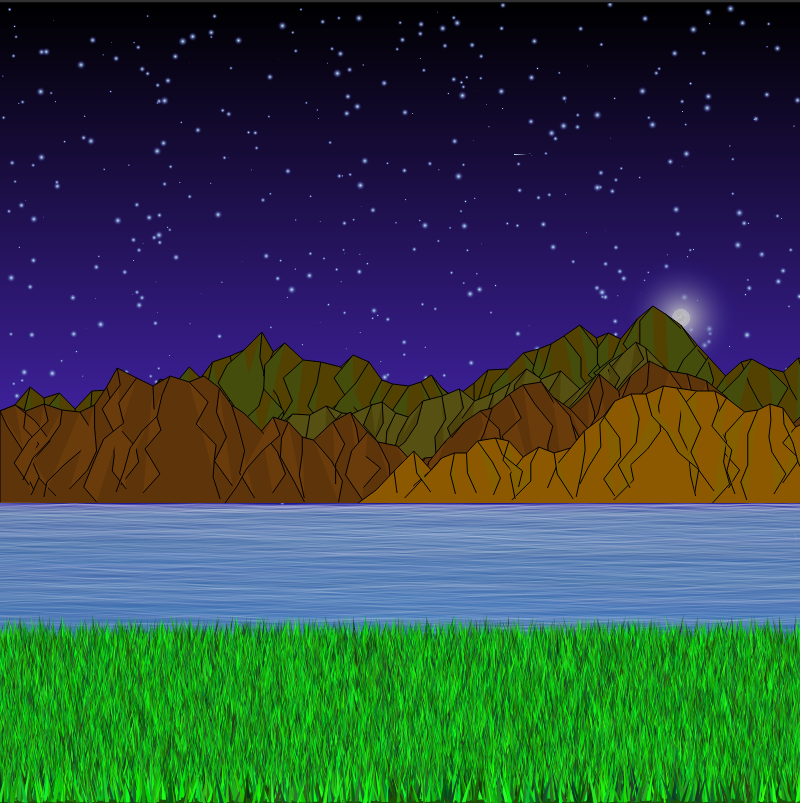

# Generateur de scene

Projet en C++ de génération de scènes aléatoire

- Génération d'un fichier svg

## Exemples de scènes genérables

# Credit

Copyright 2020, DETOURNAY Vivien, PICHON Gauthier, HILT Florian, All rights reserved.
